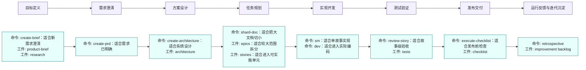
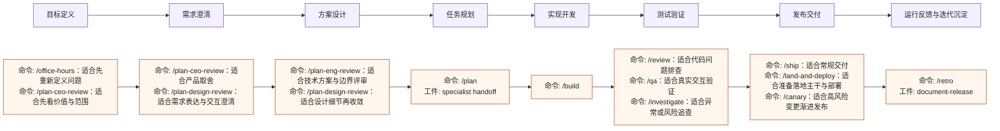
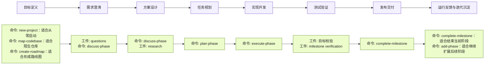
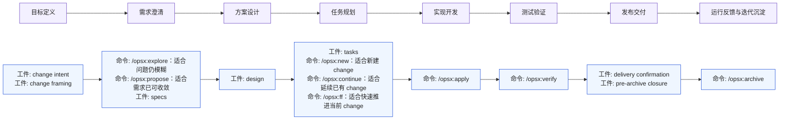
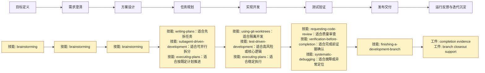
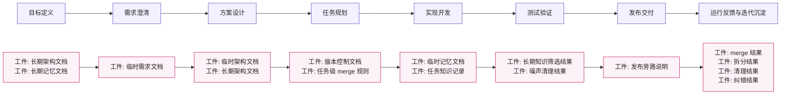
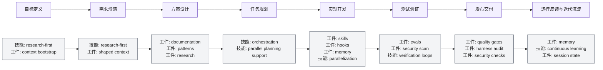

# 软件工程生命周期视角下的工作流体系总对比

## 目的

本文回答三个问题：

- `BMAD` 和 `gstack` 是否都属于软件工程全生命周期工作流
- 七个体系在生命周期上分别覆盖什么
- 它们之间是替代关系、重合关系，还是分层组合关系

本文不做强弱排名，只使用统一生命周期标尺比较七个体系。

## 判断标准

本文统一把软件工程生命周期划分为 8 个阶段：

1. `目标定义`
   识别要解决的问题、产品方向、业务目标和边界。
2. `需求澄清`
   澄清场景、约束、优先级、范围和验收预期。
3. `方案设计`
   形成产品设计、技术设计、架构决策和关键取舍。
4. `任务规划`
   把设计拆成可执行任务、阶段、故事、计划或变更工件。
5. `实现开发`
   编码、重构、联调、并行子任务执行。
6. `测试验证`
   包括测试、review、验收、质量门禁和回归确认。
7. `发布交付`
   包括分支收尾、PR、部署、上线、交付准备。
8. `运行反馈与迭代沉淀`
   包括复盘、归档、知识沉淀、后续版本规划和持续学习。

覆盖判断只分三类：

- `主覆盖`：该阶段是这个体系的显式核心组成部分
- `辅助覆盖`：该阶段有所涉及，但不是主轴
- `基本不覆盖`：该阶段没有形成稳定方法或不是其关注重点

## 七个体系的生命周期拆解

### BMAD

`BMAD` 是显式的全生命周期方法论，官方文档给出四阶段模型：

- `Analysis`
- `Planning`
- `Solutioning`
- `Implementation`

对应关系如下：

- `Analysis`：目标探索与需求发现
- `Planning`：需求定义
- `Solutioning`：技术方案与架构决策
- `Implementation`：按 story 逐步开发、review、retrospective

它覆盖从前期探索到落地实施的完整方法链，并根据复杂度切换 `Quick Flow`、`BMad Method`、`Enterprise` 等轨道。

结论：

- `BMAD` 属于完整生命周期框架
- 对中大型项目和多角色协作更友好
- 在“规划深度”“角色分工”“文档化程度”上明显偏重

### gstack

`gstack` 也是完整生命周期工作流，但组织方式更偏冲刺链路，而不是抽象 phase：

`Think -> Plan -> Build -> Review -> Test -> Ship -> Reflect`

它把各步骤映射到具名角色命令，例如：

- `/office-hours` 负责重新定义问题和目标
- `/plan-ceo-review` 负责产品和范围重审
- `/plan-eng-review` 负责架构、数据流、边界情况和测试计划
- `/review` 负责代码问题审查
- `/qa` 负责真实交互测试和回归
- `/ship` 负责同步主干、测试、PR 和交付
- `/retro` 负责复盘

因此它更像面向单人或超小团队的“虚拟团队工作流”。

结论：

- `gstack` 也属于完整生命周期工作流
- 它比 `BMAD` 更偏单人多角色、高速冲刺和实操链路
- 它的方法论重量低于 `BMAD`，但端到端覆盖并不窄

### GSD

`GSD` 的公开定位是：

- 轻量
- context engineering 驱动
- spec-driven development 驱动
- 面向单人开发者

它的主链路大致是：

`new-project -> create-roadmap -> discuss-phase -> plan-phase -> execute-phase -> complete-milestone`

已有代码库时则先加上：

`map-codebase`

它覆盖目标、需求、阶段规划、执行和归档，但更强调少命令、少仪式、尽快进入产出。它不像 `BMAD` 那样强调组织层方法论，也不像 `OpenSpec` 那样只聚焦单次 change 的 formal spec。

结论：

- `GSD` 也可以视为轻量全生命周期 workflow
- 但它更像单人主导、少仪式、高自动化的执行系统
- 它与 `BMAD`、`gstack` 有重合，但明显更轻

### OpenSpec

`OpenSpec` 的官方定位是 `Spec-driven development (SDD) for AI coding assistants`。

它的核心不是管理整个软件组织，而是为每一次具体变更建立正式规格。它强调：

- 先对齐要做什么，再写代码
- 每个 change 有独立的 proposal、specs、design、tasks
- 工件可以流动更新，而不是僵硬阶段门

`OPSX` 主链路大致是：

`proposal -> specs -> design -> tasks -> implement -> archive`

它的主轴是：

- 需求收敛
- 规格与设计
- 实施任务
- 实现与验证
- 归档闭环

但它并不天然负责：

- 组织级路线图管理
- 长周期项目组合治理
- 完整的发布运营体系

结论：

- `OpenSpec` 不是完整软件工程管理框架
- 它更准确地说是“变更规格层”或“活跃 change 的事实源”
- 它最适合嵌入别的主 workflow，而不是单独承担全部工程管理责任

### Superpowers

`Superpowers` 的官方定位是：

- 一套 agentic skills framework
- 同时也是 software development methodology

从公开技能结构看，它的核心不是规格定义，而是执行纪律。基本链路是：

`brainstorming -> using-git-worktrees -> writing-plans -> subagent-driven-development/executing-plans -> test-driven-development -> requesting-code-review -> finishing-a-development-branch`

它特别强调：

- 设计先于写码
- 计划先于实现
- TDD
- review
- verification
- 分支收尾

它更关心“范围已定之后，如何以更稳的工程纪律把事情做出来”。

结论：

- `Superpowers` 覆盖了生命周期中的前中后段，但重心在执行阶段
- 它不是最强的需求管理层，也不是最强的项目组合层
- 它本质上更接近“执行纪律层”

### everythingclaudecode

`everythingclaudecode` 的官方定位是：

- `The performance optimization system for AI agent harnesses`

并明确强调它不是“只是一些配置”，而是一整套：

- skills
- instincts
- memory optimization
- continuous learning
- security scanning
- research-first development
- hooks / rules / MCP configs

它的主问题不是需求规划，而是让代理运行环境更强、更稳、更安全、更省 token、更可复用。

它确实会触达软件生命周期中的多个环节，例如：

- research-first
- verification loops
- parallelization
- memory persistence
- security scanning

但这些更多是在增强 agent harness 本身，而不是替代一个完整的软件工程 workflow。

结论：

- `everythingclaudecode` 不是主 workflow
- 它更像 harness 增强层或运行环境基座
- 它与 `Superpowers` 有部分执行面重合，但层级不同

### RepoMem

`RepoMem` 现在已经是一个可执行的独立 skill。它的核心不是主 workflow 编排，也不是单次 change 的 formal spec，而是在仓库内部建立持续演化的知识分层：

- 长期架构文档
- 长期记忆文档
- 版本控制文档
- 临时架构文档
- 临时记忆文档
- 临时需求文档

它的关键机制是：

- `repo-mem init`
- 任务开始时创建临时文档
- 任务进行中把局部知识先沉淀到临时层
- 任务结束后把稳定知识 merge 回长期层
- 长期层持续拆分、清理、纠错和模块化

它现在已经具备明确的动作面：

- `init`
- `read`
- `capture`
- `merge`
- `prune`
- `split`

并且具备了更清晰的工程边界：

- `merge` 永远是 HITL 强约束
- `prune` 和 `split` 先生成建议，再由人审核或直接修改文档
- 主语言驱动长期层与主协作链路
- 副语言只作为 `persist` 的镜像层
- skill 包、模板源和 runtime 自举文档显式隔离

因此它主要解决的问题是：

- 如何让仓库持续保留跨任务有效的结构知识
- 如何让任务中产生的新知识有地方先落，再经过筛选进入长期基座
- 如何把“当前变更的信息”和“仓库长期记忆”明确分层

它和 `OpenSpec` 的差异在于：

- `OpenSpec` 更关注单个 change 的规格闭环
- `RepoMem` 更关注仓库级长期知识的沉淀、归并与清理

它和 `everythingclaudecode` 的差异在于：

- `everythingclaudecode` 更关注 harness 层的记忆基础设施与持续学习
- `RepoMem` 更关注仓库内显式文档化的知识结构

结论：

- `RepoMem` 不是完整生命周期主 workflow
- `RepoMem` 也不是执行纪律层
- `RepoMem` 更准确地说是“仓库记忆体层”或“长期知识治理层”
- 与早期概念相比，它已经演化成“独立主 skill，但非主 delivery workflow”

## 先回答：BMAD 和 gstack 是不是都属于软件工程全生命周期工作流

结论是：`是，但不是同一种风格的全生命周期工作流`。

共同点：

- 都覆盖从问题定义到实现交付的主链路
- 都不是只做单一步骤的工具包
- 都把多个角色或职责串成一条连续流程

主要差异：

- `BMAD` 更像方法论框架，强调阶段、轨道、工件和适配复杂度
- `gstack` 更像高密度实战冲刺系统，强调一组虚拟专家按 sprint 顺序接力
- `BMAD` 更适合中大型项目、多角色协作、较正式的规划与分层
- `gstack` 更适合单人或极小团队，以较低管理负担完成端到端交付

所以你当前的理解基本成立：

- `BMAD` 更重，适合中大型项目
- `gstack` 更轻，适合单人多角色场景

但需要补一条修正：

- `gstack` 虽然更轻，不代表它不覆盖全生命周期；它覆盖得很完整，只是表达方式更“冲刺化”而不是“方法论化”

## 生命周期覆盖矩阵

| 工作流/体系 | 目标定义 | 需求澄清 | 方案设计 | 任务规划 | 实现开发 | 测试验证 | 发布交付 | 运行反馈与迭代沉淀 |
| --- | --- | --- | --- | --- | --- | --- | --- | --- |
| `BMAD` | 主覆盖 | 主覆盖 | 主覆盖 | 主覆盖 | 主覆盖 | 主覆盖 | 辅助覆盖 | 辅助覆盖 |
| `gstack` | 主覆盖 | 主覆盖 | 主覆盖 | 主覆盖 | 主覆盖 | 主覆盖 | 主覆盖 | 主覆盖 |
| `GSD` | 主覆盖 | 主覆盖 | 辅助覆盖 | 主覆盖 | 主覆盖 | 辅助覆盖 | 辅助覆盖 | 主覆盖 |
| `OpenSpec` | 辅助覆盖 | 主覆盖 | 主覆盖 | 主覆盖 | 主覆盖 | 主覆盖 | 辅助覆盖 | 主覆盖 |
| `Superpowers` | 辅助覆盖 | 辅助覆盖 | 主覆盖 | 主覆盖 | 主覆盖 | 主覆盖 | 主覆盖 | 辅助覆盖 |
| `everythingclaudecode` | 基本不覆盖 | 辅助覆盖 | 辅助覆盖 | 辅助覆盖 | 主覆盖 | 主覆盖 | 辅助覆盖 | 主覆盖 |
| `RepoMem` | 基本不覆盖 | 辅助覆盖 | 主覆盖 | 辅助覆盖 | 辅助覆盖 | 辅助覆盖 | 基本不覆盖 | 主覆盖 |

### 如何读这张表

- `BMAD`、`gstack`、`GSD` 最接近“主 workflow”
- `OpenSpec` 最接近“围绕单个 change 的规格与闭环系统”
- `Superpowers` 最接近“执行纪律系统”
- `RepoMem` 最接近“仓库记忆体与长期知识治理系统”
- `everythingclaudecode` 最接近“harness 增强与运行环境系统”

## 生命周期对应关系图

下面不再使用一张混合总图，而是按同一模板分别展示 7 个工作流。每张图都使用相同的 8 个生命周期阶段作为横向骨架，只填入该工作流自己的主公开命令或主技能。

### 命令，工件，技能

- `命令`
  指触发一个动作的入口。通常是 slash command、CLI 动作、脚本入口或某个明确可调用操作。它回答“现在执行什么动作”。
- `技能`
  指做某类事情的方法封装。通常包含一套流程、约束、检查表或执行习惯。它回答“这类事情应该怎么做”。
- `工件`
  指流程中沉淀下来的结果物。通常是文档、任务列表、设计稿、验证结果、归档记录等。它回答“这个阶段留下了什么可读、可交接、可验证的内容”。

图中的统一优先级如下：

1. 优先展示 `命令`
2. 如果缺少明确命令，则展示 `技能`
3. 如果缺少明确命令和技能，则展示 `工件`

这样做的原因是：

- `命令` 最接近实际怎么使用
- `技能` 代表能力入口，适合像 `Superpowers` 这类体系
- `工件` 代表关键结果，适合像 `OpenSpec`、`RepoMem` 这类文档驱动体系

`阶段` 不再作为图内标签展示，因为横轴已经承担生命周期阶段的表达。只有在像 `BMAD` 这类自带方法论阶段模型的 workflow 中，才会在图后说明中补充提及其内部阶段体系。

### BMAD 生命周期图

- `目标定义`
  `create-brief` 用于形成目标简报，`product-brief` 用于沉淀目标，`research` 用于补齐外部信息。
- `需求澄清`
  `create-prd` 用于把需求收敛成 PRD，`create-architecture` 可在需求明确后提前进入方案预备。
- `方案设计`
  `create-architecture` 和 `architecture` 用于形成技术方案与架构取舍。
- `任务规划`
  `epics` 适合较大主题拆分，`stories` 适合进入具体实施，`shard-doc` 适合把大规格切成更可执行的小单元。
- `实现开发`
  `sm` 适合按单个 story 推进，`dev` 适合实际编码实现。
- `测试验证`
  `review-story` 负责故事级检查，`tests` 负责行为验证。
- `发布交付`
  `execute-checklist` 适合按发布检查清单收尾，`checklist` 是发布前的结果工件。
- `运行反馈与迭代沉淀`
  `retrospective` 用于复盘，`improvement backlog` 用于把经验回写到后续工作。

  补充：`BMAD` 仍然保留其内部的 `Analysis / Planning / Solutioning / Implementation` 四阶段方法论，但图中不再把这些阶段重复写进节点。

### gstack 生命周期图

- `目标定义`
  `/office-hours` 适合重新界定问题，`/plan-ceo-review` 适合从产品价值角度收敛目标。
- `需求澄清`
  `/plan-ceo-review` 偏范围和优先级，`/plan-design-review` 偏需求表达与体验细化。
- `方案设计`
  `/plan-eng-review` 偏工程实现与架构，`/plan-design-review` 偏设计层补全。
- `任务规划`
  `/plan` 用于形成可执行计划，`specialist handoff` 表示把计划交给下游角色执行。
- `实现开发`
  `/build` 是主要实现入口。
- `测试验证`
  `/review` 看代码质量，`/qa` 看使用行为，`/investigate` 看疑难问题。
- `发布交付`
  `/ship` 适合标准交付，`/land-and-deploy` 适合正式落地，`/canary` 适合风险较高的渐进发布。
- `运行反馈与迭代沉淀`
  `/retro` 用于复盘，`document-release` 用于沉淀版本输出。

### GSD 生命周期图

- `目标定义`
  `new-project` 适合新项目起步，`map-codebase` 适合陌生代码库摸底，`create-roadmap` 适合形成中期路线。
- `需求澄清`
  `questions` 和 `discuss-phase` 用于澄清目标、边界和未知项。
- `方案设计`
  `discuss-phase` 持续收敛方案，`research` 用于补足依据。
- `任务规划`
  `plan-phase` 把阶段目标拆成执行计划。
- `实现开发`
  `execute-phase` 是主实现阶段。
- `测试验证`
  `目标校验` 和 `milestone verification` 用于确认阶段结果是否达标。
- `发布交付`
  `complete-milestone` 用于收尾当前里程碑。
- `运行反馈与迭代沉淀`
  `complete-milestone` 结束当前周期，`add-phase` 用于衔接下一阶段。

### OpenSpec 生命周期图

- `目标定义`
  OpenSpec 通常不是从产品目标启动，而是从已有 change 意图切入。
- `需求澄清`
  `/opsx:explore` 适合先探索问题，`/opsx:propose` 适合把需求转成正式 change，`specs` 是核心规格工件。
- `方案设计`
  `design` 用于沉淀具体方案与边界。
- `任务规划`
  `tasks` 是任务清单，`/opsx:new` 适合新建 change，`/opsx:continue` 适合续做，`/opsx:ff` 适合快速前进。
- `实现开发`
  `/opsx:apply` 是按规格落地实现。
- `测试验证`
  `/opsx:verify` 用于对照规格验证结果。
- `发布交付`
  这一段重点是保证 change 在归档前完成交付闭环。
- `运行反馈与迭代沉淀`
  `/opsx:archive` 用于形成可追溯归档。

### Superpowers 生命周期图

- `目标定义`
  `brainstorming` 可辅助理解用户意图，但不是主产品管理系统。
- `需求澄清`
  `brainstorming` 用于通过对话把目标和约束说清楚。
- `方案设计`
  `brainstorming` 继续承担设计收敛。
- `任务规划`
  `writing-plans` 适合写计划，`subagent-driven-development` 适合并行拆分，`executing-plans` 适合按计划执行。
- `实现开发`
  `using-git-worktrees` 适合隔离环境，`test-driven-development` 适合高风险改动，`executing-plans` 适合稳定推进。
- `测试验证`
  `requesting-code-review` 看质量，`verification-before-completion` 看证据，`systematic-debugging` 看问题定位。
- `发布交付`
  `finishing-a-development-branch` 用于分支收尾和合并准备。
- `运行反馈与迭代沉淀`
  这一段更多是完成证据与收尾支持，不负责长期知识治理。

### RepoMem 生命周期图

- `目标定义`
  长期架构文档和长期记忆文档提供任务启动前的仓库上下文。
- `需求澄清`
  `临时需求文档` 用于承接当前任务的 PRD 级需求。
- `方案设计`
  `临时架构文档` 承接本次设计，`长期架构文档` 负责吸收稳定结构。
- `任务规划`
  `版本控制文档` 管未来版本，`merge 规则` 管任务结束后如何回写长期层。
- `实现开发`
  `临时记忆文档` 用于持续记录任务过程中的隐性知识。
- `测试验证`
  这一段重点不是测试工具，而是筛选哪些知识值得长期保留。
- `发布交付`
  RepoMem 一般不直接承担发布动作。
- `运行反馈与迭代沉淀`
  `merge / 拆分 / 清理 / 纠错` 是长期知识治理的核心动作。

### everythingclaudecode 生命周期图

- `目标定义`
  `research-first` 和 `memory/context bootstrapping` 用于在任务前建立更强的上下文。
- `需求澄清`
  `research-first` 和 `context shaping` 用于提高上下文质量，而不是直接定义需求。
- `方案设计`
  `documentation`、`patterns`、`research` 负责为方案提供知识支持。
- `任务规划`
  `orchestration` 和 `parallel planning support` 用于提升任务编排效率。
- `实现开发`
  `skills`、`hooks`、`memory` 是执行环境能力，`parallelization` 适合并行任务。
- `测试验证`
  `evals` 看效果，`security scan` 看安全，`verification loops` 看循环校验。
- `发布交付`
  `quality gates`、`harness audit`、`security checks` 用于提升发布前可靠性。
- `运行反馈与迭代沉淀`
  `memory`、`continuous learning`、`session state` 负责持续学习和跨会话延续。

## 重合、互补与边界

### 第一组：BMAD、gstack、GSD

这三者是最容易被放在一起比较的，因为它们都试图组织“从起点到交付”的主流程。

但内部仍然有明显区别：

- `BMAD` 是方法论最完整、分层最清楚的一组
- `gstack` 是角色最鲜明、冲刺最顺手的一组
- `GSD` 是命令最少、自动化最重、单人最友好的一组

重合点：

- 都覆盖前期问题定义
- 都覆盖需求与规划
- 都覆盖实现与后续推进

不同点：

- `BMAD` 最强调阶段方法
- `gstack` 最强调虚拟团队接力
- `GSD` 最强调 context engineering 和低仪式高产出

### 第二组：OpenSpec

`OpenSpec` 与前三者重合的地方主要在：

- 需求澄清
- 规格设计
- 任务定义
- 验证闭环

但差别在于：

- 它不是“整个项目怎么推进”的最高层
- 它是“当前变更该做什么”的正式事实源

因此它和前三者的关系，更像：

- 可嵌入
- 可承接
- 可作为执行前的 formalization 层

而不是简单替代。

### 第三组：Superpowers

`Superpowers` 与 `gstack`、`GSD` 在执行面有显著重合，因为它们都处理：

- brainstorming
- planning
- implementation discipline
- review
- verification
- branch completion

但 `Superpowers` 的优势是：

- 执行纪律更系统
- 对工程过程控制更强
- 更适合和别的规格层配合

所以它更像一个可以外挂到主 workflow 上的“执行强化层”。

### 第四组：everythingclaudecode

`everythingclaudecode` 与所有前述体系都存在局部交叉，但最不应该把它误判成“另一套主 workflow”。

它更像：

- 给代理加记忆
- 给代理加安全与扫描
- 给代理加 eval 和 verification loop
- 给代理加并行与路由
- 给代理加跨 harness 的一致运行方式

所以它与其他体系的关系更像底座增强，而不是直接竞争“谁负责 roadmap / spec / implementation flow”。

### 第五组：RepoMem

`RepoMem` 与所有前述体系的关系都不是简单替代，而更像仓库级知识治理层。

它与 `OpenSpec` 的重合在于：

- 都关注当前任务产生的文档工件
- 都承认任务需要显式规格或显式知识容器

但差异也很大：

- `OpenSpec` 重点是 change 规格闭环
- `RepoMem` 重点是长期知识归并与清理

它与 `everythingclaudecode` 的重合在于：

- 都关心记忆
- 都关心跨任务持续有效的信息

但层级不同：

- `everythingclaudecode` 偏 harness 基础设施
- `RepoMem` 偏仓库内显式文档结构

但和前面文档早期状态不同的是，`RepoMem` 现在已经是一个可单独调用的 skill，而不只是概念层。

因此更准确的判断是：

- `RepoMem` 可以独立使用
- 但它独立承担的是“仓库长期知识治理”这一主职责
- 它并不独立替代其他全生命周期 delivery workflow

## 初步分层结论

如果按职责分层，而不是按名气或 star 数分层，这七个体系更合理的归位是：

- `BMAD`、`gstack`、`GSD`：完整生命周期 workflow 候选
- `OpenSpec`：规格层
- `Superpowers`：执行纪律层
- `RepoMem`：仓库记忆体层
- `everythingclaudecode`：harness 增强层

这也是为什么把它们直接放进一个扁平排行榜里，会很容易比较失真。

## 对后续仓库设计的启示

对于这个 `Coding Agent Harness System` 仓库，后续如果要整理成可复用 workflow contractor 文档，比较合理的方向不是“每个体系都做一份平行替代说明”，而是先明确以下问题：

- 哪些文档在定义主 workflow
- 哪些文档在定义单个 change 的 formal spec 方式
- 哪些文档在定义执行纪律
- 哪些文档在定义仓库长期记忆与知识治理
- 哪些文档在定义 harness 护栏与增强

否则很容易把“主流程”和“配套层”写成同一级文档，导致读者误以为它们互相替代，实际上它们多数时候应该组合使用。

## 本文的工作性结论

1. `BMAD` 和 `gstack` 都可以视为软件工程全生命周期工作流。
2. `BMAD` 更重、更适合中大型项目和更正式的多角色协作。
3. `gstack` 更轻、更适合单人或极小团队的多角色高速推进。
4. `GSD` 也是全生命周期 workflow，但更轻、更少仪式、更偏单人自动化。
5. `OpenSpec` 不是主 workflow，而是活跃变更的规格层。
6. `Superpowers` 不是主 workflow，而是工程执行纪律层。
7. `RepoMem` 不是主 delivery workflow，而是仓库记忆体层。
8. `everythingclaudecode` 不是主 workflow，而是 harness 增强层。
9. 后续做 workflow contractor 命名时，应该先区分“主 workflow 文档”和“组合层文档”，而不是把这些体系并列当成同级替代品。

## 参考来源

- BMAD Method 官方文档，四阶段架构说明：<https://docs.bmad-method.org/explanation/architecture/four-phases/>
- BMAD 官方仓库：<https://github.com/bmad-code-org/BMAD-METHOD>
- gstack 官方仓库：<https://github.com/garrytan/gstack>
- GSD 官方仓库：<https://github.com/gsd-build/get-shit-done>
- OpenSpec 官方仓库：<https://github.com/Fission-AI/OpenSpec>
- Superpowers 官方仓库：<https://github.com/obra/superpowers>
- everythingclaudecode 官方仓库：<https://github.com/affaan-m/everything-claude-code>
- RepoMem skill：[/home/shenzhou/Codes/CodingAgentHarnessSystem/RepoMem/repo-mem/SKILL.md](/home/shenzhou/Codes/CodingAgentHarnessSystem/RepoMem/repo-mem/SKILL.md)
- RepoMem 运行态版本计划：[/home/shenzhou/Codes/CodingAgentHarnessSystem/RepoMem/docs/self/persist/version-plan.md](/home/shenzhou/Codes/CodingAgentHarnessSystem/RepoMem/docs/self/persist/version-plan.md)
